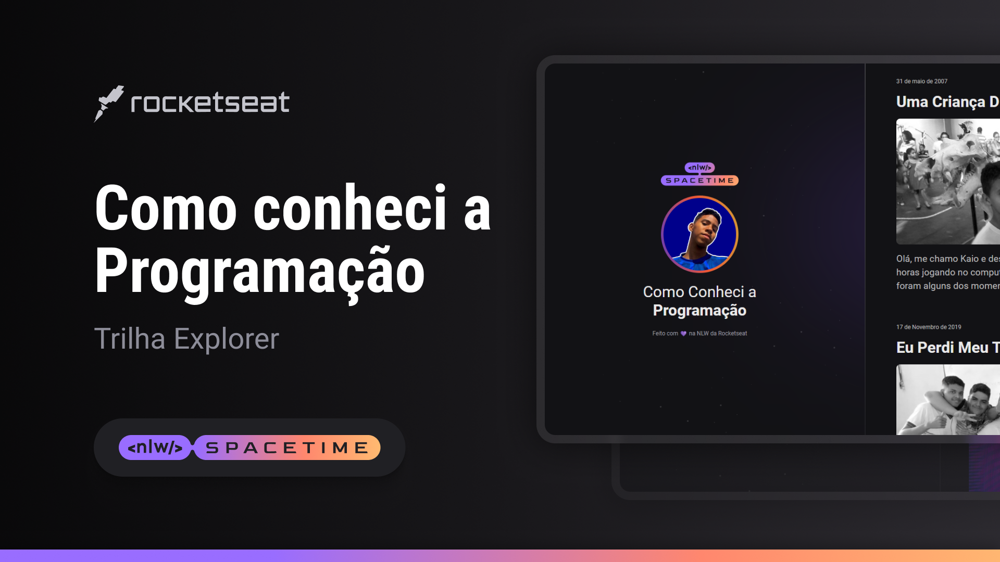

  

<h1>Esse é meu primeiro projeto 😁</h1>

  
Recentemente tive a oportunidade de participar do NLW Spacetime, um evento da Rocketseat, eu confesso que fiquei apavorado vendo todos esses códigos, mas conseguir ir até o fim.

  <h2>Os desafios</h2>

  
Ao longo do meu caminho na programação, enfrentei diversos desafios. Um dos primeiros foi a falta de recursos e orientação adequados. No entanto, encontrei a Rocketseat, parecia um sonho com o curso gratis e a comunidades incrível.

  
Outro desafio foi aprender a lidar com a frustração que muitas vezes acompanha o processo de programação. Enfrentei problemas difíceis de solucionar. No entanto, aprendi a importância da persistência e do pensamento criativo na resolução de problemas, e esses desafios me tornaram um programador mais habilidoso.

  <h2>Conclusão</h2>

  
Minha jornada na programação tem sido repleta de desafios e conquistas. O conhecimento e as habilidades adquiridas me permitiram transformar minhas ideias em realidade. A programação se tornou uma paixão que continua a crescer e me desafiar diariamente.
